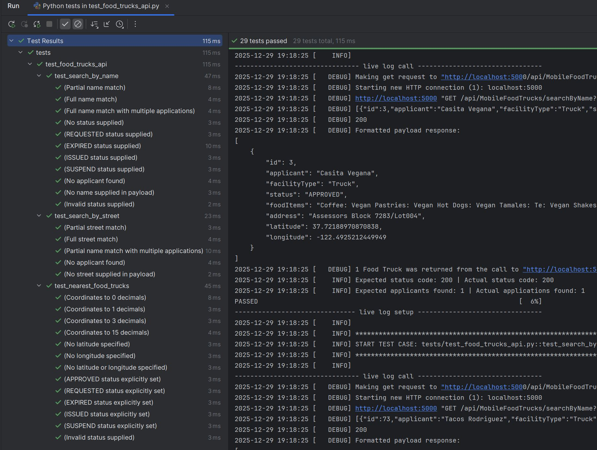

# Automated tests for Food Trucks API
This simple Python project has tests for the three Food Truck Challenge API endpoints.

## Running the tests
1. Follow the Food Truck API readme to run the Food Truck application locally
   1. https://github.com/radaisystems/food-trucks-challenge/blob/main/README.md#running-the-application
2. Install the python dependencies in requirements.txt
3. Run the pytest tests using the command line or an IDE 

## Example test results

Note: The steps should be more detailed and tested to know that they can be followed
